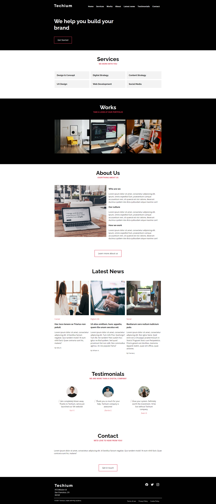

# Resources
# Read or watch:

- A Complete Guide to Flexbox | CSS-Tricks
- Flexbox Froggy - A game for learning CSS flexbox
- Flexbox Defense
- Flexbox Cheatsheet
- CSS Flexible Box Layout - CSS: Cascading Style Sheets | MDN
- afonsopacifer/awesome-flexbox: A curated list of CSS Flexible Box Layout Module or only Flexbox.
- Build with Flexbox
- Flexplorer
- CSS Flexible Box Layout Module Level 1
- FLEX: A simple visual cheatsheet for flexbox

## Learning Objectives
- At the end of this project, you are expected to be able to explain to anyone, without the help of Google:

- What is Flexbox?
- How to convert float positioning to a flex display
- How to horizontally and vertically align elements using Flexbox
- The difference between the main and cross axes
- Properties that work on flex elements vs flex container
- Shorthands for flex
- How to create a new page with flex in mind

### Goal of this project
- Below is an image of an already styled document. You are expected to achieve the same results by now applying flexbox for the layout.
 
